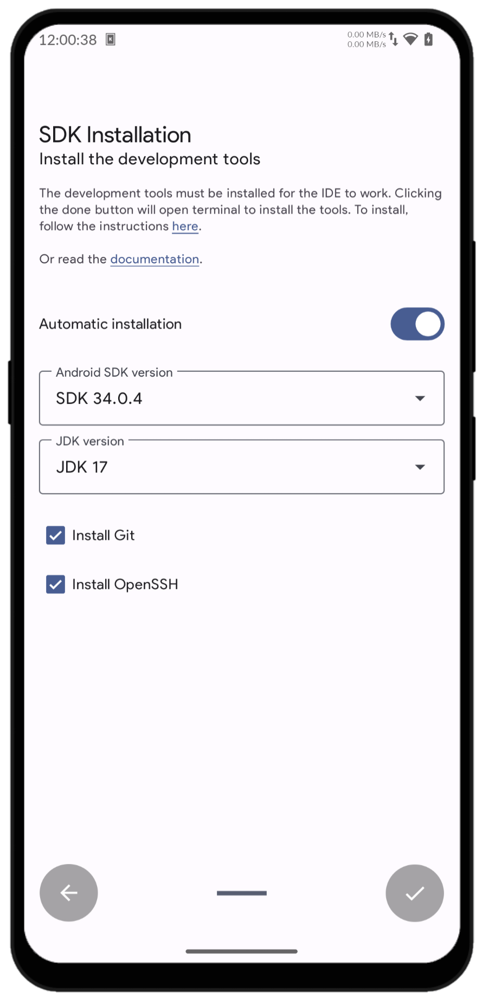
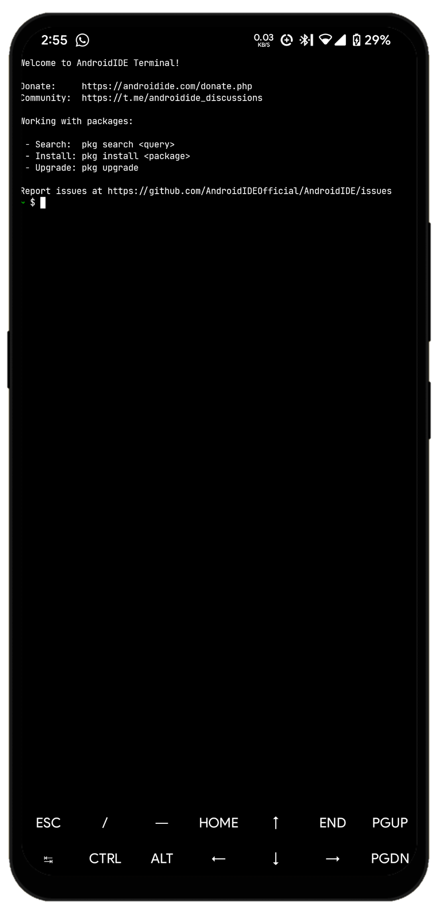

# Installation

This guide walks you through the installation process for AndroidIDE,
including setting up the terminal and installing Android build tools.

## Minimum Requirements

Before proceeding, ensure that your Android device meets these minimum requirements:

### Supported CPU Architectures

- `arm64-v8a`
- `armeabi-v7a`
- `x86_64` (requires AndroidIDE v2.7.0-beta or newer)

### RAM

Enough **available** RAM, You will be working with the Gradle build system. Depending on the size of your project,
you'll need enough **free RAM** so that the Gradle Daemon is not killed by the system. A minimum of **1.5GB - 2GB free RAM** is recommended.

### Storage Space

Enough storage space - A minimum of 4GB free storage space is required. You'll need enough space for various Gradle
distributions and dependencies, according to your project configuration. After the basic setup, around 1GB of space is
used by AndroidIDE (without any dependencies or distributions installed)

### Internet Connection

WiFi connection is recommended for the initial setup.

## Download AndroidIDE Application

[](https://f-droid.org/packages/com.itsaky.androidide)
[](https://github.com/AndroidIDEOfficial/AndroidIDE/releases)

:::danger Before Updating the APK!!!

F-Droid and GitHub builds are incompatible with each other! If you have already installed AndroidIDE from GitHub and if
you try to install AndroidIDE from F-Droid, it won't be installed. Same goes for installing GitHub builds over F-Droid builds.

Please make sure that you download the files only from the **trusted** sources above. Installing it from unknown sources
may pose a security risk to your device.

:::

<a class="button button--lg button--primary margin-vert--md" href="https://github.com/AndroidIDEOfficial/AndroidIDE/actions">
  <svg xmlns="http://www.w3.org/2000/svg" fill="none" viewBox="0 0 24 24" stroke-width="1.5" stroke="currentColor" class="button-icon">
    <path stroke-linecap="round" stroke-linejoin="round" d="M3 16.5v2.25A2.25 2.25 0 0 0 5.25 21h13.5A2.25 2.25 0 0 0 21 18.75V16.5M16.5 12 12 16.5m0 0L7.5 12m4.5 4.5V3" />
  </svg>
  Debug Version
</a>

:::danger Attention!!!

Debug version is for testing purposes.

- To download the debug version, choose `Build and test` workflow, then download the artifact.
- Make sure to be logged in to GitHub in your browser when downloading artifacts.

:::

## Basic Setup

Before getting started with building projects, you need to install the basic build tools which are necessary for the IDE
to function properly.

When you open the application for the first time, you'll be presented with the onboarding screen which will guide you to installing
AndroidIDE and ask you for the following permissions :

- **Storage** - Required to work with files on the File System.
- **Install packages** - Required for installing apps built with AndroidIDE.
- **Post Notifications** - For Android 13 and above, you need to grant the `POST_NOTIFICATION` permission. This will be used to show notifications on your device.

There are three methods to install AndroidIDE:

- Automated installation

  - Configure your installation with the GUI. This simply executes the `idesetup` script in the terminal. Once the installation is complete, it will automatically navigate you to the home screen.

    :::tip Note!

    Automated installation option is only available in **v2.7.0-beta** and newer.

    :::

- Manual installation

  - `idesetup` script - provides you various options to install the tools.
    See [installation with idesetup](#build-tools-installation).

  - Fully manual - manually install the tools by yourself. Choose this if you have already downloaded the tools or if you want to install
    custom tools in AndroidIDE. This can also be beneficial if you frequently re-install AndroidIDE.

After you have granted the permissions, you'll be navigated to `Setup tools` screen which you can use to configure the installation.
For example, you can choose to install `JDK 21` instead of `JDK 17` which is installed by default.

<details>
  <summary>The below images show the SDK installation GUI and the terminal activity respectively:</summary>
  <div class="container">
    <div class="row">
      <div class="col"></div>
      <div class="col"></div>
    </div>
  </div>
</details>

## Setup the Terminal

1. Open AndroidIDE terminal.
2. It will install bootstrap packages if required.
3. Run `pkg upgrade` to update packages to the latest version.

## Build Tools Installation

Install JDK, SDK, and commandline tools for SDK.

:::tip Tips

You dont need to do this anymore with latest version of AndroidIDE.

:::

1. Open the terminal and run `idesetup -c`.
2. Confirm the configuration and start the installation process by typing `y`.
3. After successful installation, `Downloads completed. You are ready to go!` will be printed.

### Cheatsheet

One command to setup the terminal and install build tools

```bash
cd && pkg upg && idesetup -c
```
